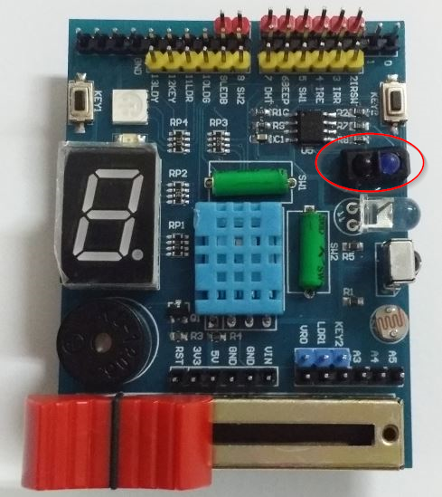
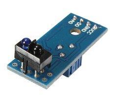
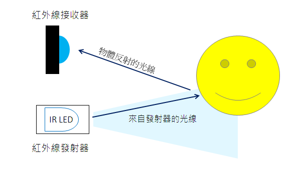
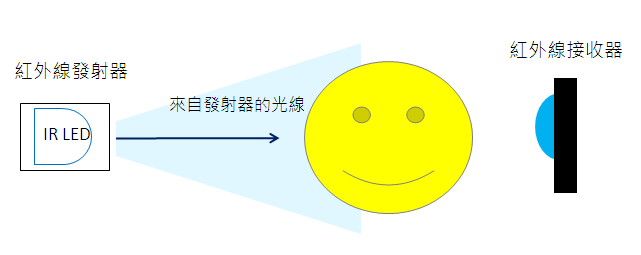
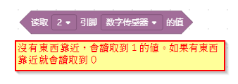

紅外線避障
===========

紅外線避障感測器，它的功能就跟一般開關的使用方式一樣，只是他的開啟跟關閉不是人手動去開關，他是會偵測是否有物體靠近，當 **有物體靠近時，讀取 D2 腳位會讀取到0，當沒有物體靠近時，讀取 D2 會讀取到 1**。

硬體原理
---------------

紅外線避障感測器有一個紅外線LED會射出紅外線光束，當有物體靠近紅外線會反射回另外一顆紅外線接收，當接收收到的反射光，超過一定能量，他就會判斷前方有物體接近。

紅外線避障感測器**只能偵測是否有物體靠近**，如果要知道物體的距離，則需要使用「超音波感測器」

生活應用：
------------------

1. 小便斗會自動沖水
#. 有物體靠近會自動開燈、開垃圾桶
#. 鐵門防夾裝置

.. raw:: html

    <iframe width="560" height="315" src="https://www.youtube.com/embed/oPjE-1shOwM" title="YouTube video player" frameborder="0" allow="accelerometer; autoplay; clipboard-write; encrypted-media; gyroscope; picture-in-picture" allowfullscreen></iframe>

指令使用:
--------------
因為這個模組功能是很簡易的讀取腳位的狀態，所以使用通用的 讀取腳位狀態積木即可。

.. note::
    <動動腦>在螢幕繪製一個垃圾桶，有垃圾桶打開、蓋上 兩種造型，然後使用外部感測器，來模擬自動開合智慧垃圾桶。

參考資料:
http://coopermaa2nd.blogspot.com/2011/03/1.html

