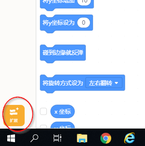
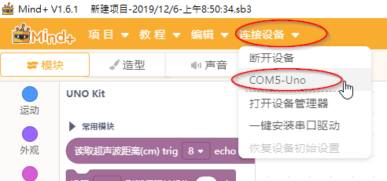

Mind+ 及 外部感應器 基礎概念
==============================

本課程選用 Mind+ 作為上課時使用的示範工具。Mind+ 是一個基於 Scratch 3 修改的程式編輯器，因為 Scratch3 是開放原始碼，因此有眾多修改自 Scratch 3 的硬體互動軟體可以選用，例如 OSEP、kittenblock、mBlock... 各套軟體都有他的優缺點及專長，我們只要了解核心的概念，自己要轉換選用哪一套軟體應該都可以自己做選擇。

1.開啟 Mind+

2.將 Arduino Uno+ IL 學習板 使用 USB 線連接到電腦。

3.接著我們要連結硬體設備，這樣 mind+ 才能跟外部硬體互動

選擇 Arduino Uno 開源套件，就會載入此硬體的相關指令積木

接著與 Arduino 連線，這裡的 COM5 可能是 COM3、COM4... 要依據自己電腦分配的串列埠號碼選擇

連線後 Mind+ 會自動更新韌體，這是其他類似軟體沒有的方便設計 （這個設計直接 +50分）

.. image:: mplus004.png

這時候就可以開始練習我們的課程了
