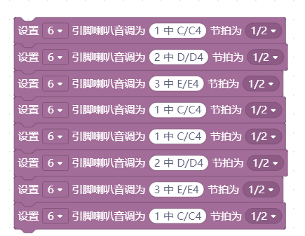

蜂鳴器 
========

常見蜂鳴器有兩種類型，不要買錯了。

有源蜂鳴器：
-------------

只要給他電源(高電位訊號，他就會發出聲音)，但是它發出的聲音頻率是固定的，沒有辦法調整。**(就是給它高電位（通電）就會一直叫，不需要調整頻率)**

無源蜂鳴器：
-------------

必須給他不同**頻率**的信號，他才會發出聲音，因此可以控制蜂鳴器的音調。

人耳能感受到的振動頻率範圍約為20-20000赫茲，不同動物能聽到的範圍不一樣。**在人耳可以聽到範圍外的頻率，我們就稱為「超音波」。**

IL 學習板上 D6 接了一個無源蜂鳴器，使用以下指令就可以讓它唱出 兩隻老虎 的前兩句  1 2 3 1 1 2 3 1

.. note::
    <動動腦>：使用滾珠開關，做一個電子樂器，搖一下會發出一個音，依序演奏天黑黑。

