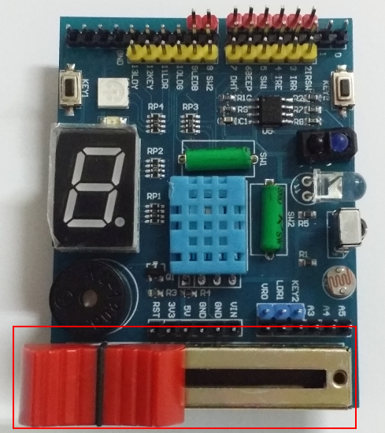
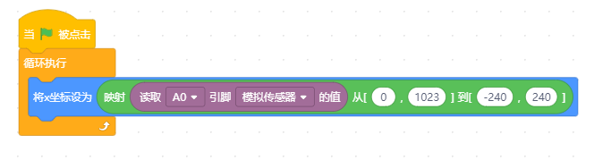

數位 vs 類比腳位
==============

Arduino  有兩種類型的腳位，一種是數位腳位 D0~D13 ，一種是「類比」**「輸入」**腳位(A0~A5)。

數位就是只能輸出入 0,1 兩種狀態， 類比輸入腳位則可以讀取外部電壓值，經由 A/D(類比/數位轉換器)把類比的值轉換成一個數值，因為 **Arduino 的 A/D 轉換器是 10bits ，所以他傳回值的範圍是 0~1023**。

.. important::
    Arduino 輸出都是數位的，只能用 pwm 模擬類比輸出，並不能輸出類比（電壓）信號。 所以不管 D0~D13 或是 A0~A5 都可以輸出 0/1 的數位信號。
    A0~A5 是指他可以「輸入」類比信號，因此把他稱為類比腳位。

IL擴充板，A0 接了一個「滑桿式的可變電阻」，我們利用讀取 A0 的值，用外面的滑桿來控制角色的移動。

移動滑桿，使用  這個指令積木，測試看看數值會有什麼變化

.. hint::
<動動腦> 滑桿輸入是 0~1023 ，電腦舞台中的角色座標，最左邊是 -240 最右邊是 240，如果想用滑桿控制角色的位置(滑桿拉左拉右，角色跟著左右移動)，應該怎麼調整角色座標?

如果我希望畫面中的角色位置，會跟著滑桿左右移動。首先要知道的是類比輸入的數值是 0~1023 、scratch角色的X位置範圍是 -240~240。

所以有一個積木可以將數值作不同範圍的對應，以下就是讓主角隨著滑桿左右移動位置的程式

★接續上面，做一個接氣球的遊戲。