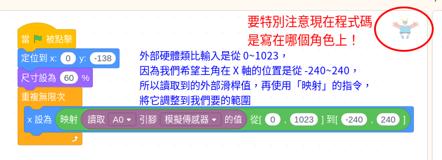
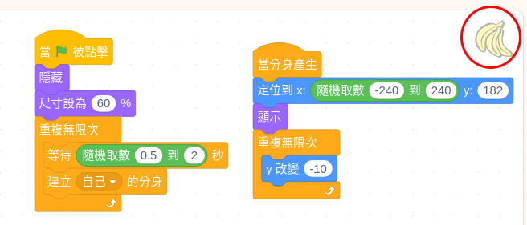
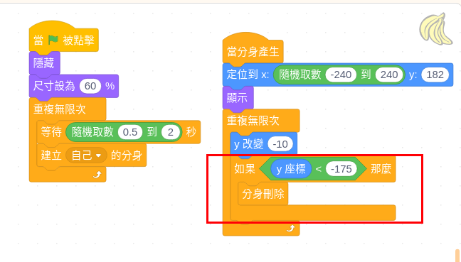
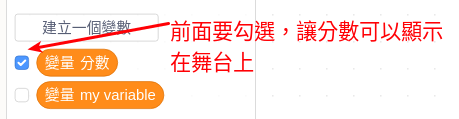
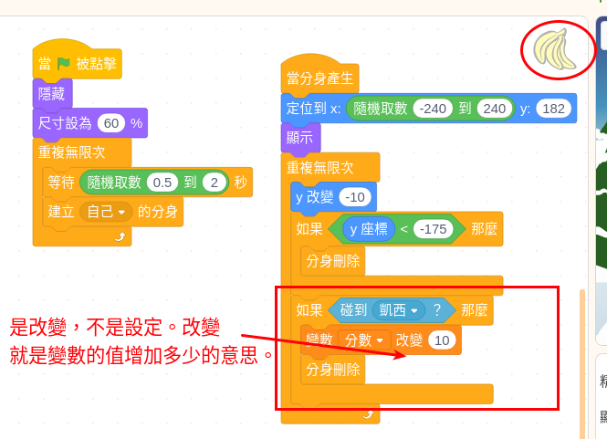
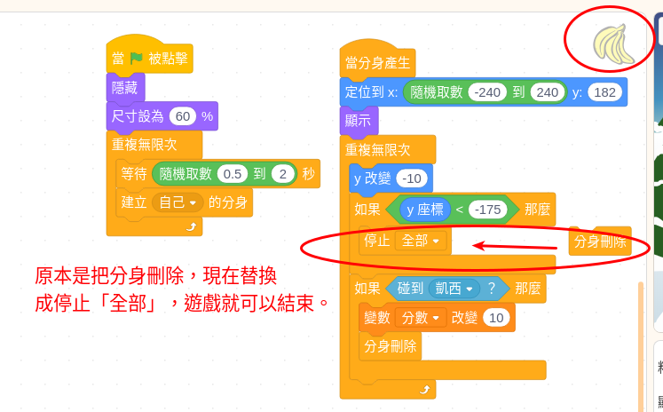

整合應用：接香蕉遊戲
===================

1. 開啟一個新的專案，刪除預設的角色

2從圖庫載入一個適合的角色當作主角，這裡選用「凱西」因為他的造型剛好接近接水果的樣子。

3.讓「凱西」會隨著外部的「滑桿」在畫面（舞台）下方左右移動，程式碼如下：

4. 新增一個「香蕉」精靈（角色），以下程式碼，可以讓香蕉可以 0.5秒～2秒 產生一個分身，分身會從螢幕上方X方向隨機的位置開始往下掉。

完成以下程式碼，應該可以看到一堆香蕉往下掉落

5.香蕉身往下掉之後，會全部堆在舞台下方，所以我們需要加一些程式碼來判斷，如果香蕉掉落到最底下，我們就將分身刪除掉。

舞台底部 Y 座標示是 -180，所以我們程式判斷當香蕉精靈的 y軸位置比 -175 小 的時候，就表示香蕉已經掉到底下，我們就將分身刪除。

.. important::
    再特別強調是 Y < -175 ，不是 Y > -175，這裡是學生常常不理解的部份。 

6. 接著我們加入一個變數「分數」，遊戲開始時分數要先設定為0。當主角接到香蕉時，我們讓分數 +10分。

分數初始化的程式碼，可以寫在任何精靈上，但是為了避免程式混亂，所以通常如果不是某個精靈專屬的程式或動作，而是跟整個遊戲有關的程式碼，我們會將它寫在舞台的程式區塊上，避免同一個初始化再不同地方重複寫很多次。

分數初始化程式記得寫在舞台上

接著判斷香蕉有沒有碰到「凱西」，如果碰到凱西，表示被接到了，我們就要將分數 +10分，並且把香蕉分身刪除。   判斷香蕉跟凱西碰撞的程式碼，我們是寫在香蕉上，碰撞偵測其實也可以寫在凱西上，試試看，如果寫在凱西上，會有什麼問題呢？

7. 一個遊戲要能結束，才算是一個基本的遊戲，所以我們設定如果有一個香蕉沒接到，遊戲就結束。

怎麼樣才能判斷有香蕉沒接到？ 其實很簡單，而且我們的程式已經有判斷過了。 ^^ 

當香蕉分身被接到，它就會被刪除，所以如果有香蕉跑到最底下沒有被刪除，就表示它沒被接到。還記得前面的程式碼哪裡有判斷過香蕉跑到最底下嗎？ 我們只要在那個判斷的區塊，加一些「遊戲結束」（Game over）的程式碼，就可以把遊戲結束了。

