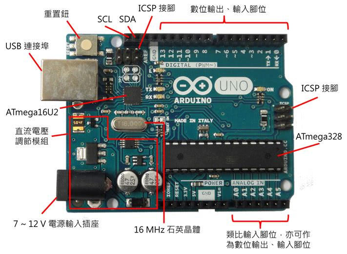

介紹
===================================
 
本課程使用 |mind+ logo|  http://mindplus.cc/ (一個基於 scratch 3 修改的積木式程式設計軟體) 及 Arduino Uno + IL 學習板 來進行外部硬體控制器教學。

.. note::
   - 這只是我用來練習 rst 寫文件的練習... 所以內容 ...

目錄
--------

.. toctree::
   introduce
   base
   led-button
   rgb-led
   buzzer
