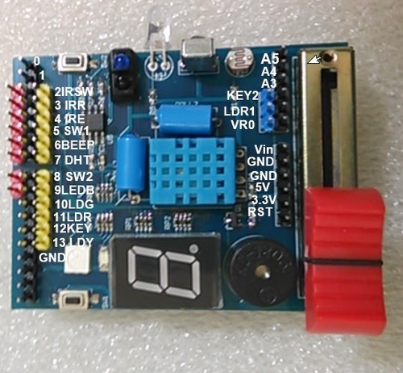

介紹
===================================

`KSB041 Yilan(宜蘭)學習板 <https://www.buyic.com.tw/product_info.php?products_id=6735>`_ (以下簡稱 IL學習板) 是宜蘭陳金助老師為了教學方便，請廠商協助開發的學習板。

這板子將一些常用的外部硬體感測元件(光敏電阻、LED、RGB LED、按鍵開關、紅外線感測器、蜂鳴器、DHT11溫濕度感測器、紅外線發射、接收模組、可變電阻 (滑桿式)、共陰極七段顯示器、滾珠開關) 整合在板子上，不需要做任何接線，很適合國小用來學習各種感測器的應用。

Arduino UNO腳與 IL 學習板元件腳位對照表
----------------------------------------

+---+----------------+----------------+
|D0 | x              |       x        |
+---+----------------+----------------+
|D1 | x              |       x        |
+---+----------------+----------------+
|D2 |紅外線避障感測器|7段顯示器a腳位  |
+---+----------------+----------------+
|D3 |紅外線發射LED   |7段顯示器b腳位  |
+---+----------------+----------------+
|D4 |紅外線接收元件  |7段顯示器c腳位  | 
+---+----------------+----------------+
|D5 |滾珠開關1       |7段顯示器d腳位  | 
+---+----------------+----------------+
|D6 |蜂鳴器          |7段顯示器 e腳位 | 
+---+----------------+----------------+
|D7 |DHT11温濕度感測器|7段顯示器 f腳位| 
+---+----------------+----------------+
|D8 |滾珠開關2       |7段顯示器 g腳位 | 
+---+----------------+----------------+
|D9 |RGB三色LED (藍B)|7段顯示器 dp腳位|
+---+----------------+----------------+
|D10|RGB三色LED (綠G)|                |
+---+----------------+----------------+
|D11|RGB三色LED (紅R)|                |
+---+----------------+----------------+
|D12|按鍵1           |                |
+---+----------------+----------------+
|D13|黃色LED         |                | 
+---+----------------+----------------+
|A0 |可變電阻(滑桿式)|                |
+---+----------------+----------------+
|A1 |光敏電阻        |                |
+---+----------------+----------------+
|A2 |按鍵2           |                |
+---+----------------+----------------+

參考網站

宜蘭竹林資訊站 http://blog.ilc.edu.tw/blog/blog/868/post/111175/727272