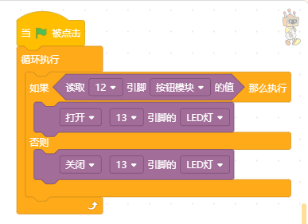
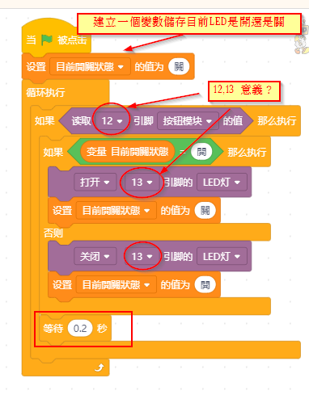
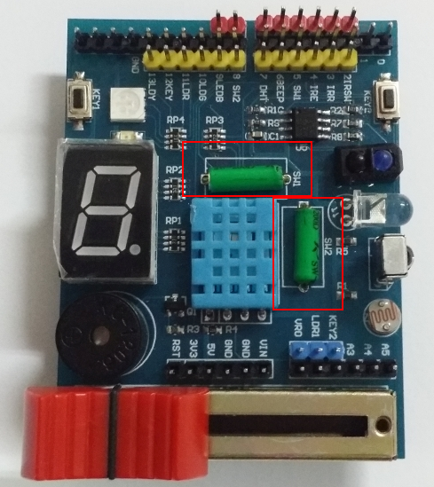
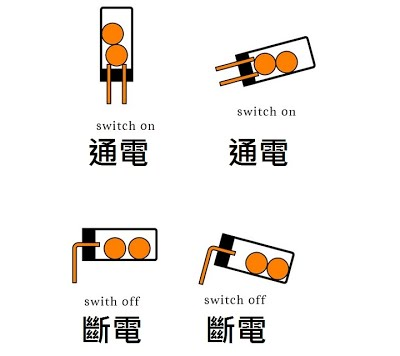
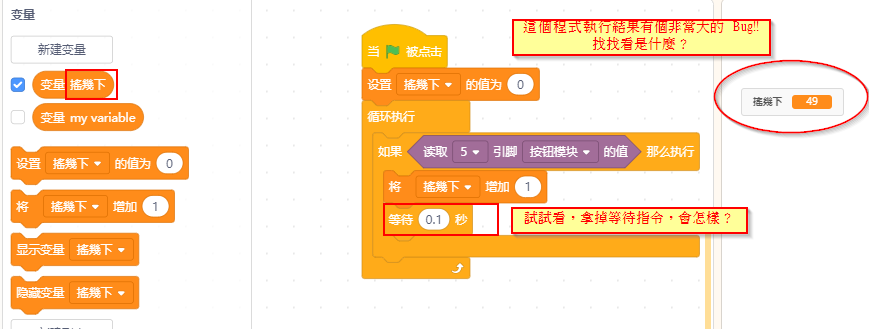

LED、按鈕開關、滾珠開關 
========================

點亮內建的 D13 LED 燈：
--------------------------
讓第13腳位的 LED 每個一秒閃爍

 .. image:: ./led000.png
 
D12 按鈕開關 :
--------------------
按下點亮 LED 燈、放開LED熄滅
沒按下時 LED 長亮、按下時 LED 熄滅

按一下 LED 亮起來、再按一下 LED 熄滅

D5 滾珠開關1: 震動的時候，會開開關關
--------------------------------------

遊戲開始計算30秒內搖幾下

.. image:: ./vibroswitch004.png

延伸應用：
----------------
1. 打氣球比賽，手搖一下氣球會越來越大，打到第50下，氣球爆炸，顯示使用的時間
#. [應用]防盜或炸彈，偵測到震動就發出警報或爆炸. 