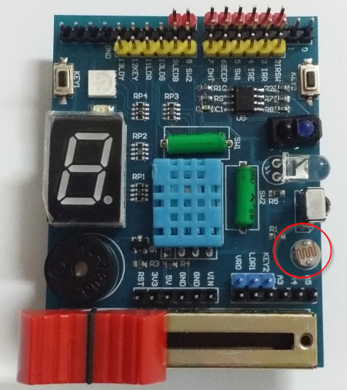
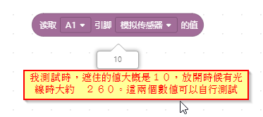
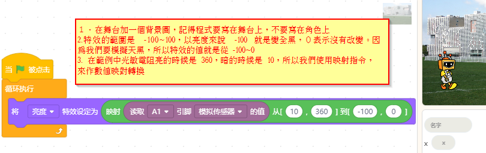

光敏電阻
=========

光敏電阻是**接在 A1 類比輸入腳位**，它的作用是用來偵測外界亮度，當亮度越亮時，讀取 A1 的值就越大，亮度越暗時，讀取A1的值越小。

可以用手慢慢靠近光敏電阻遮住光線，就可以看到數值的變化。

1. 舞台選一張背景圖，請讀取光敏電阻，調整舞台的亮度，讓舞台可以模擬白天晚上。

.. note::
<生活應用>夜間會自動照明。當光線越來越暗，光敏電阻的值低於某個數值時，就自動點亮電燈。

