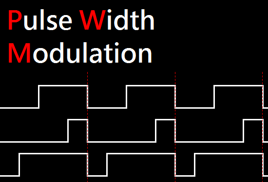
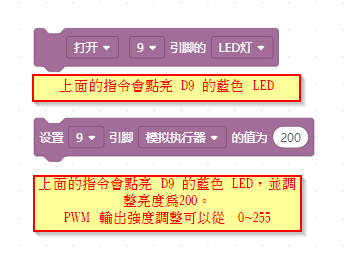
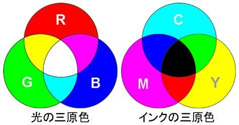
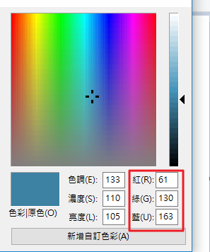
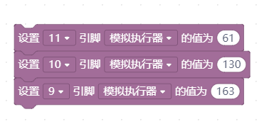

RGB 三色LED
===========

**RGB 三色LED，就是把 紅、綠、藍三顆不同顏色的LED燈封裝在一個LED模組。**

在介紹 RGB LED 前，我們先了解怎麼調整 LED 亮度。
**PWM (脈衝寬度調變)**，電腦只能輸出數位( 0 和1 )，以 LED 來說就是「亮」或「不亮」兩種狀態，如果我們希望能調整 LED 亮度，這時候電腦會使用 PWM 技術，就是短時間內讓 LED 一下子亮一下子不亮，因為這樣開開關關的速度很快，所以我們眼睛會看到 LED 燈變暗卻不會看到 LED 忽亮忽暗。

只要調整開跟關的時間比例，就可以控制亮度。

先使用 D9 三色LED (藍B) 來測試，調整 LED 亮度

.. note::
 [作業]有些設備或手機會有一個燈會慢慢亮起來，再慢慢熄滅，看起來就像機器在呼吸一樣，這個燈我們稱為呼吸燈。試試看，使用 D9 藍色 LED 來呈現呼吸燈的狀態。

<To do...>

RGB全彩燈原理
--------------

R(紅)G(綠)B(藍) 光三原色 vs 青(C)洋红(M)黄(Y) 印刷三原色：

光的成色原理是加色法，光線會越加越亮，當光線亮到一定程度的時候就變成白光。

印刷是油墨吸收掉光線，所以油墨或水彩會越加越黑，當 CMY 全部都加在一起時會接近黑色，但是因為不夠黑，所以通常會再加入黑色(K)來當作油墨做印刷，這也是為什麼常見到四種顏色墨水的噴墨印表機。

IL 學習板上面有一顆 RGB 三色 LED，只要調整這三顆 LED 的亮度，就可以讓 RGB LED 呈現不同顏色。  

如果不知道怎麼調出自己想要的顏色，幾乎所有繪圖軟體都有顏色選擇功能，例如我們使用小畫家的顏色挑選，挑選想要的顏色，他就會呈現 RGB 的比例，我們可以參考這三個值來撰寫我們的程式。 

**注意： IL 學習板 RGB 的腳位是 D11, D10, D9 ，不要將 RGB 的值填錯了。**

         